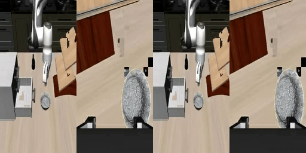
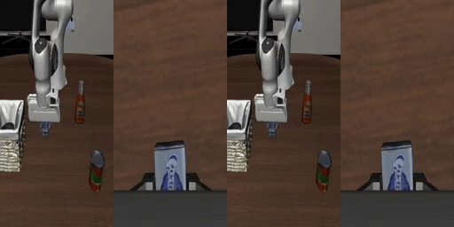
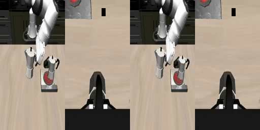

# DIT4DIT

A **mimic-video**–style video–action model: LoRA-finetune a Cosmos video backbone, then train a lightweight DiT with flow matching for action prediction on **LIBERO** manipulation tasks (LeRobot-format data).

## Preliminary Results (Stage 1)

Early validation of the Stage 1 LoRA finetuning (Left: Ground Truth | Right: DiT Auto-encoder reconstruction from noise):

<p align="center">
  
  
  
</p>

## Overview

- **Data**: Built-in support for all 4 LIBERO suites via `--suite` (`libero_spatial`, `libero_object`, `libero_goal`, `libero_10`). Uses 100% of available demonstrations for training to maximize simulated evaluation metrics.
- **Cameras**: agentview + wrist (`observation.images.image` / `observation.images.wrist_image`), 256×256, concatenated side-by-side into a single stream
- **State / actions**: 8-D proprio, 7-D actions (x, y, z, roll, pitch, yaw, gripper), action chunk size 16
- **Video**: 17 pixel frames → 5 latent frames (2 conditional + 3 predicted), 10 FPS
- **Backbone**: `nvidia/Cosmos-Predict2-2B-Video2World` + LoRA
- **Action head**: ~67M-parameter DiT + flow matching
- **Training**: two stages — Stage 1 video prediction (LoRA) → Stage 2 action prediction

## Setup

```bash
pip install -r requirements.txt
# For LIBERO sim eval (WebSocket server + client):
pip install websockets
```

**Python 3.10+**, **CUDA**, and **bf16** are recommended (training defaults to bf16).

## Configuration

Hyperparameters and the suite registry live in `configs/config.py` (`DataConfig`, `ModelConfig`, `Stage1Config`, `Stage2Config`, `LIBERO_SUITES`). Edit that file to change global settings, camera keys, W&B project names, or dataset proportions.

## Training

Choose a suite to train on: `libero_spatial`, `libero_object`, `libero_goal`, or `libero_10`. 
The `--suite` argument automatically manages Hugging Face repo IDs, episode counts, multi-task T5 embeddings, and checkpoint directories.

```bash
# 1. Precompute multi-task T5 text embeddings for the suite
python scripts/precompute_embeddings.py --suite libero_object --cosmos_model_id  your_cosmos_model_path

# (Optional) Precompute VAE latents for speed:
# python scripts/precompute_embeddings.py --suite libero_object --latents

# 2. Stage 1: video backbone LoRA (auto-saves to checkpoints/libero_object/stage1/)
torchrun --nproc_per_node=5 scripts/train_stage1.py \
    --suite libero_object \
    --cosmos_model_id your_cosmos_model_path \
    --wandb_project "dit4dit-stage1" \
    --resume checkpoints/libero_object/stage1/step_5000

# 3. Stage 2: action decoder (auto-loads Stage 1 & saves to checkpoints/libero_object/stage2/)
torchrun --nproc_per_node=5 scripts/train_stage2.py \
    --suite libero_object \
    --cosmos_model_id your_cosmos_model_path \
    --stage1_checkpoint checkpoints/libero_object/stage1/4000 \
    --wandb_project "dit4dit-stage2" \
    --resume checkpoints/libero_object/stage2/step_1000
```

*(Optional) To evaluate offline Action MSE (requires manually setting `val_episodes > 0` in `config.py` for the suite):*
```bash
python scripts/evaluate.py --suite libero_object --cosmos_model_id your_cosmos_model_path
```

Evaluation scripts set `HF_HUB_OFFLINE=1` so Hugging Face models are resolved from the local cache when possible; the first run still needs network access to download Cosmos / T5 weights.

## LIBERO simulation evaluation

Evaluation is performed zero-shot on novel initial state distributions in simulation.
Install [LIBERO](https://github.com/Lifelong-Robot-Learning/LIBERO) in a **separate** environment, then run the WebSocket server and sim client (see also `LIBERO_evaluation/setup.sh`).

**Terminal 1 — model server (e.g., your training env):**

```bash
conda activate mimic
python scripts/eval_server.py \
  --stage1_checkpoint checkpoints/stage1/final \
  --stage2_checkpoint checkpoints/stage2/final
```

**Terminal 2 — LIBERO client (e.g., your LIBERO simulator env):**

```bash
python LIBERO_evaluation/libero_client.py \
  --server_url ws://localhost:8765 \
  --suites libero_object \
  --num_episodes 50 \
  --save_video
```

## Inference latency benchmark (optional)

```bash
python scripts/benchmark_latency.py --dry_run
python scripts/benchmark_latency.py --device cuda --warmup 3 --repeats 10
```

## Repository layout

```
DIT4DIT/
├── configs/
│   └── config.py                 # Data / model / two-stage training config / Suite Registry
├── mimic_video/
│   ├── data/
│   │   ├── dataset.py            # MimicVideoDataset (LeRobot + Multi-task handling)
│   │   └── transforms.py         # Two-camera concat, normalization, etc.
│   ├── models/
│   │   ├── video_backbone.py     # Cosmos + LoRA + hidden-state hooks
│   │   ├── action_decoder.py     # ActionDecoderDiT (flow matching)
│   │   └── flow_matching.py      # Scheduler and ODE solver
│   ├── training/
│   │   ├── stage1_trainer.py
│   │   └── stage2_trainer.py
│   └── inference/
│       └── policy.py             # MimicVideoPolicy (inference wrapper)
├── LIBERO_evaluation/
│   ├── libero_client.py          # Sim client talking to eval_server
│   └── setup.sh                  # Two-env run notes (edit paths for your machine)
└── scripts/
    ├── precompute_embeddings.py
    ├── train_stage1.py
    ├── train_stage2.py
    ├── evaluate.py
    ├── eval_server.py            # WebSocket server for LIBERO
    └── benchmark_latency.py
```

## Reference

Paper: **mimic-video: Video-Action Models for Generalizable Robot Control Beyond VLAs**. This repo is an independent reimplementation / extension; behavior and defaults are defined by the code and `configs/config.py`.
