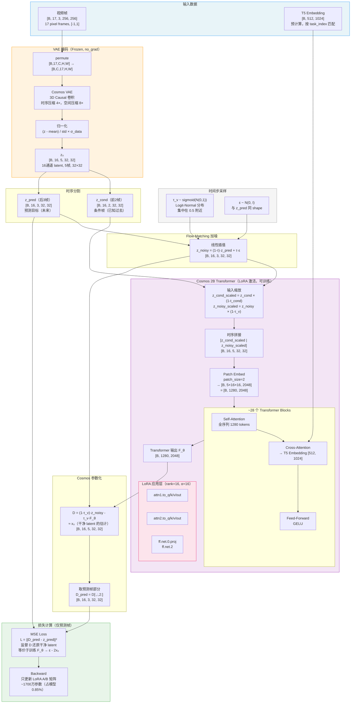

```mermaid
flowchart TD
    subgraph INPUT["输入数据"]
        V["视频帧\n[B, 17, 3, 256, 256]\n17 pixel frames, [-1,1]"]
        T5["T5 Embedding\n[B, 512, 1024]\n预计算，按 task_index 匹配"]
    end

    subgraph TAU["时间步采样"]
        SAMPLE["τ_v ~ sigmoid(N(0,1))\nLogit-Normal 分布\n集中在 0.5 附近"]
        EPS["ε ~ N(0, I)\n与 z_pred 同 shape"]
    end

    subgraph VAE_BLOCK["VAE 编码（Frozen, no_grad）"]
        PERM["permute\n[B,17,C,H,W] → [B,C,17,H,W]"]
        VAE["Cosmos VAE\n3D Causal 卷积\n时序压缩 4×，空间压缩 8×"]
        NORM["归一化\n(z - mean) / std × σ_data"]
        Z0["z₀\n[B, 16, 5, 32, 32]\n16通道 latent, 5帧, 32×32"]
    end

    subgraph SPLIT["时序分割"]
        ZCOND["z_cond（前2帧）\n[B, 16, 2, 32, 32]\n条件帧（已知过去）"]
        ZPRED["z_pred（后3帧）\n[B, 16, 3, 32, 32]\n预测目标（未来）"]
    end

    subgraph NOISE["Flow Matching 加噪"]
        INTERP["线性插值\nz_noisy = (1-τ)·z_pred + τ·ε\n[B, 16, 3, 32, 32]"]
    end

    subgraph COSMOS["Cosmos 2B Transformer（LoRA 激活，可训练）"]
        direction TB
        SCALE["输入缩放\nz_cond_scaled = z_cond × (1-t_cond)\nz_noisy_scaled = z_noisy × (1-τ_v)"]
        CONCAT["时序拼接\n[z_cond_scaled | z_noisy_scaled]\n[B, 16, 5, 32, 32]"]
        PATCH["Patch Embed\npatch_size=2\n→ [B, 5×16×16, 2048]\n= [B, 1280, 2048]"]

        subgraph BLOCKS["~28 个 Transformer Blocks"]
            direction TB
            SA["Self-Attention\n全序列 1280 tokens"]
            CA["Cross-Attention\n→ T5 Embedding [512, 1024]"]
            FF["Feed-Forward\nGELU"]
            SA --> CA --> FF
        end

        subgraph LORA["LoRA 应用层（rank=16, α=16）"]
            direction LR
            L1["attn1.to_q/k/v/out"]
            L2["attn2.to_q/k/v/out"]
            L3["ff.net.0.proj\nff.net.2"]
        end

        OUT["Transformer 输出 F_θ\n[B, 1280, 2048]"]

        SCALE --> CONCAT --> PATCH --> BLOCKS --> OUT
    end

    subgraph PARAM["Cosmos 参数化"]
        FULL["D = (1-τ_v)·z_noisy - τ_v·F_θ\n≈ x₀（干净 latent 的估计）\n[B, 16, 5, 32, 32]"]
        SPLIT2["取预测帧部分\nD_pred = D[:,:,2:]\n[B, 16, 3, 32, 32]"]
    end

    subgraph LOSS_BLOCK["损失计算（仅预测帧）"]
        LOSS["MSE Loss\nL = ||D_pred - z_pred||²\n监督 D 还原干净 latent\n等价于训练 F_θ → ε - 2x₀"]
        GRAD["Backward\n只更新 LoRA A/B 矩阵\n~1700万参数（占模型0.85%）"]
    end

    V --> PERM --> VAE --> NORM --> Z0
    Z0 --> ZCOND
    Z0 --> ZPRED
    SAMPLE --> INTERP
    EPS --> INTERP
    ZPRED --> INTERP
    ZCOND --> SCALE
    INTERP --> SCALE
    T5 --> CA
    OUT --> FULL
    INTERP --> FULL
    FULL --> SPLIT2
    SPLIT2 --> LOSS
    ZPRED --> LOSS
    LOSS --> GRAD

    style INPUT fill:#e8f4f8,stroke:#2196F3
    style VAE_BLOCK fill:#fff3e0,stroke:#FF9800
    style COSMOS fill:#f3e5f5,stroke:#9C27B0
    style LORA fill:#fce4ec,stroke:#E91E63
    style LOSS_BLOCK fill:#e8f5e9,stroke:#4CAF50
    style TAU fill:#f5f5f5,stroke:#9E9E9E
```
